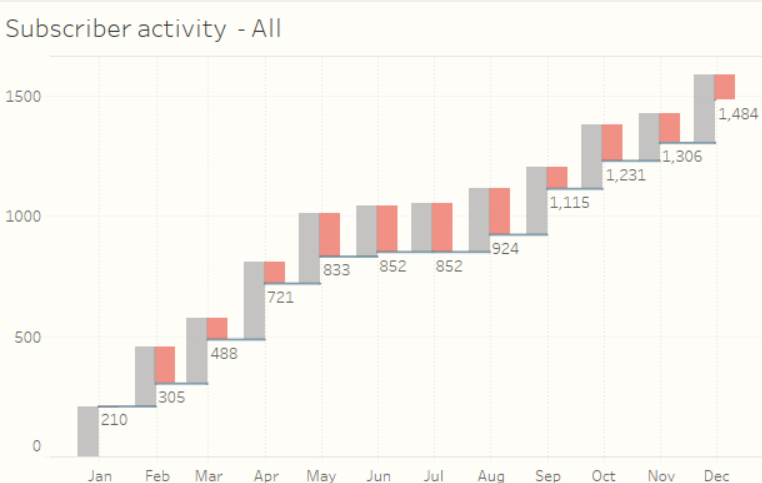
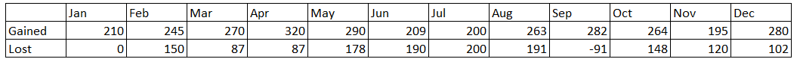

<h1 align="center">Churn-rate-visualizations-in-Python</h1>

 Combining my passion for coding and data, I wanted to recreate a data visualization in Tableau that I saw while reading and working on a SQL data analysis training course. This relates to having a view of a company's churn rate in relation to its subscribers. 

 You can visit the article: "The Churn Dashboard Explained" at www.datarevelations.com where the author Steve Wexler explains how he created the Churn Dashboard visualization in Tableau.Churn rate visualizations in Python 

 
<em>Figure 1. Original visualization proposed in Steve Wexler's article</em>

 In this article, I will share with you the code and the result for the proposed waterfall/line chart visualization so as not to make the article too long.  
 At the end of the article, you can check both codes on my GitHub page and also the nbviewer links for the Jupyter notebooks. 
 Keep in mind that the code can certainly be improved, but I would like to share it in case someone like me wants to plot similar charts and could use this as a starting point, as I did not find too many examples online when I searched for this topic. 
 Let us take the same data from the reference to create the visualization for the churn rates from the reference. This is fictitious data on subscriber gain and loss over the course of a year, assuming that the company starts acquiring subscribers in January. 

 
<em>Table 1. Fictitious data on subscriber gain and loss</em>

